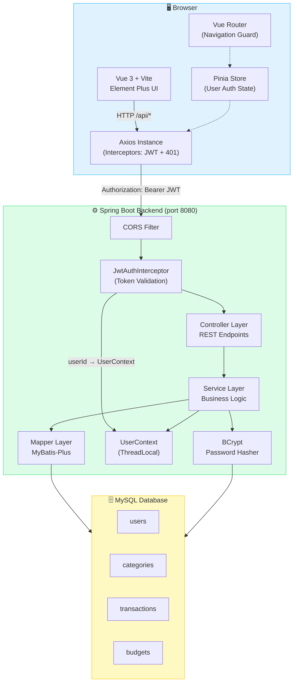
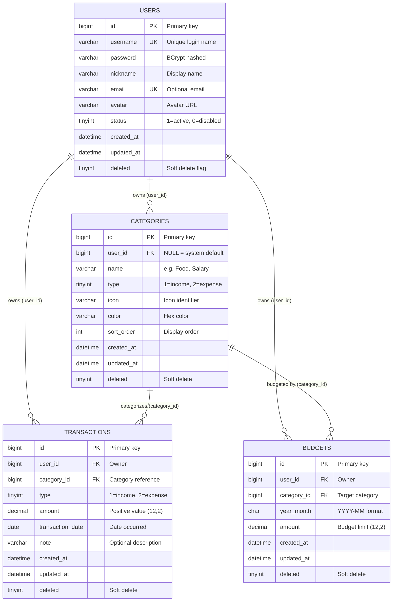
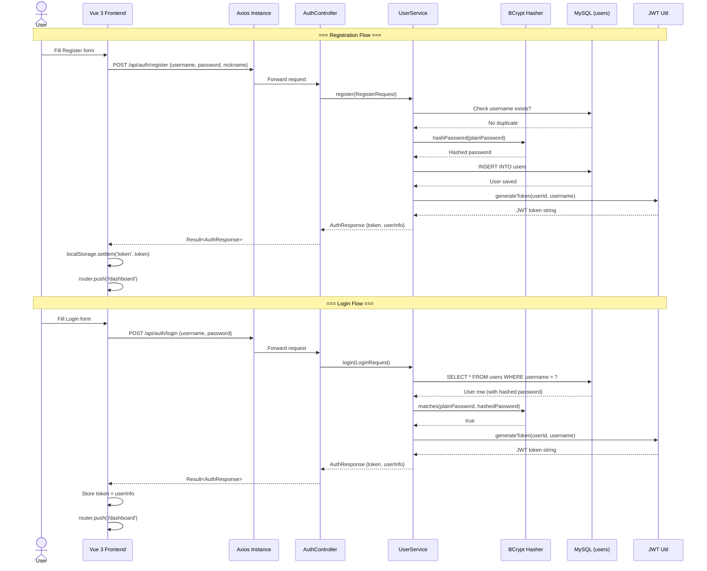
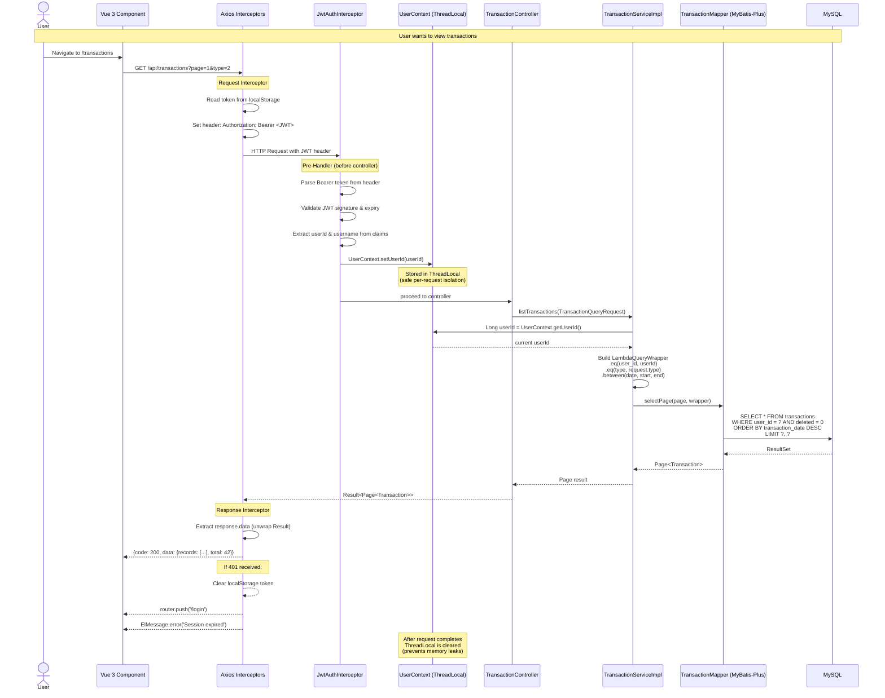
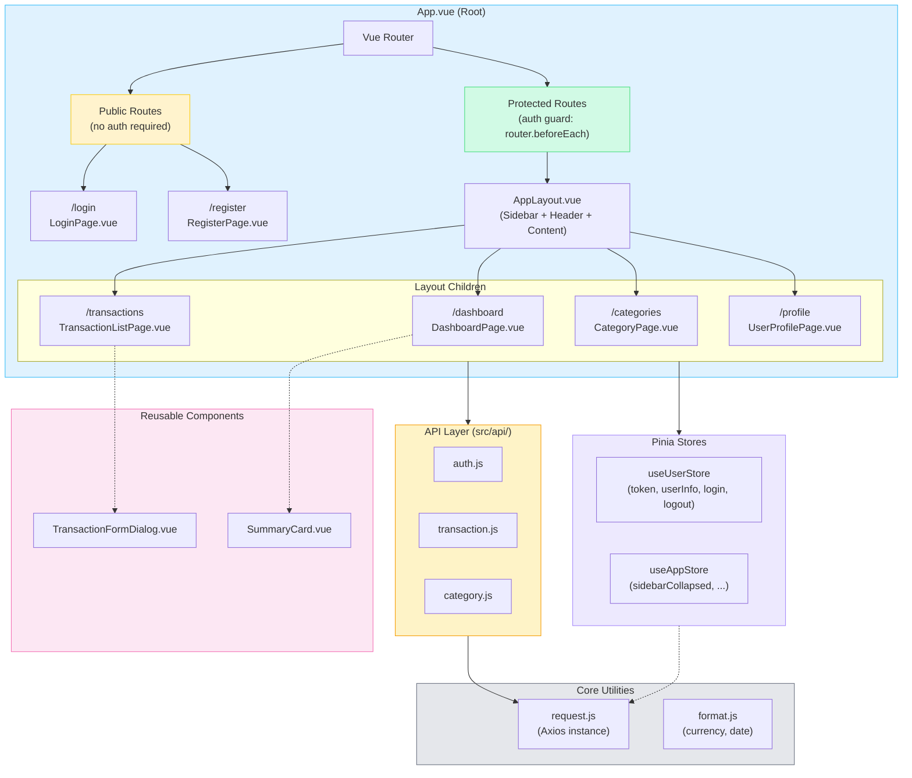

# Personal Online Bookkeeping System

A full-stack web application for personal income/expense tracking, built as a university assignment for the "Practice of Software Development" course.

## Tech Stack

| Layer | Technology |
|-------|-----------|
| Frontend | Vue 3, Element Plus, Axios, ECharts |
| Backend | Spring Boot 2.7.x, MyBatis-Plus 3.5.x |
| Database | MySQL 5.7 / 8.0 |
| Build | Maven (backend), Vite (frontend) |

## Required Core Features

| # | Feature | Description |
|---|---------|-------------|
| 1 | **User Authentication** | Registration, login, and secure logout with username/password. Username uniqueness verification, encrypted password storage (BCrypt), and route guards to block unauthorized access. |
| 2 | **Bill Management** | Full CRUD for bills (income/expense records). Fixed income/expense categories, reverse chronological sorting, quick filtering by type (income vs. expense). |
| 3 | **Category Management** | Full CRUD for income and expense categories, including user-scoped custom categories and system default categories. |

---

## Architecture & How It Works

### 1. System Architecture Overview



### 2. Database Entity Relationship Diagram (ERD)



### 3. Authentication Flow



### 4. Authenticated Request Lifecycle (Full Flow)



### 5. Frontend Component Tree & Routing



### 6. Backend Package & Layer Diagram

```mermaid
graph LR
    subgraph REQ["Incoming HTTP Request"]
    end

    subgraph FILTER["Filter / Interceptor Layer"]
        CORS["CorsFilter<br/>(@Configuration)"]
        JWT_F["JwtAuthInterceptor<br/>(implements HandlerInterceptor)"]
    end

    subgraph CTRL_LAYER["Controller Layer (REST)"]
        AUTH_CTRL["AuthController<br/>/api/auth/*"]
        CAT_CTRL["CategoryController<br/>/api/categories/*"]
        TXN_CTRL["TransactionController<br/>/api/transactions/*"]
    end

    subgraph SVC_LAYER["Service Layer (Business Logic)"]
        USER_SVC["UserServiceImpl"]
        CAT_SVC["CategoryServiceImpl"]
        TXN_SVC["TransactionServiceImpl"]
    end

    subgraph INFRA["Infrastructure / Cross-Cutting"]
        JWT_UTIL["JwtUtil<br/>(generate / parse)"]
        PWD_CFG["PasswordConfig<br/>(BCrypt bean)"]
        UCTX["UserContext<br/>(ThreadLocal<Long>)"]
        EX_HANDLER["GlobalExceptionHandler<br/>(@RestControllerAdvice)"]
        RESULT["Result<T><br/>(unified response)"]
    end

    subgraph DATA["Data Access Layer"]
        USER_M["UserMapper<br/>extends BaseMapper"]
        CAT_M["CategoryMapper<br/>extends BaseMapper"]
        TXN_M["TransactionMapper<br/>extends BaseMapper"]
        BUD_M["BudgetMapper<br/>extends BaseMapper"]
    end

    subgraph DB_L["MySQL Database"]
    end

    REQ --> CORS
    CORS --> JWT_F
    JWT_F --> CTRL_LAYER
    CTRL_LAYER --> SVC_LAYER
    SVC_LAYER --> DATA
    SVC_LAYER --> INFRA
    JWT_F --> INFRA
    DATA --> DB_L

    style REQ fill:#fce7f3,stroke:#ec4899
    style FILTER fill:#fff7ed,stroke:#f97316
    style CTRL_LAYER fill:#e0f2fe,stroke:#38bdf8
    style SVC_LAYER fill:#dcfce7,stroke:#4ade80
    style INFRA fill:#fef3c7,stroke:#f59e0b
    style DATA fill:#ede9fe,stroke:#a78bfa
    style DB_L fill:#f0fdf4,stroke:#22c55e
```



---

## Project Documents

| File | Description |
|------|-------------|
| `SPRINT_PLAN.md` | 10-day day-by-day sprint plan |
| `SCAFFOLDING_GUIDE.md` | Step-by-step setup for both projects |
| `PROJECT_STRUCTURE.md` | Folder layout and architecture best practices |
| `db/schema.sql` | MySQL DDL for all tables |
| `db/seed.sql` | Default category seed data |

## Quick Start

### 1. Database

```bash
mysql -u root -p < db/schema.sql
mysql -u root -p < db/seed.sql
```

### 2. Backend

```bash
cd bookkeeping-backend
# Edit src/main/resources/application.yml with your MySQL credentials
mvn spring-boot:run
# Runs on http://localhost:8080
```

### 3. Frontend

```bash
cd bookkeeping-frontend
npm install
npm run dev
# Runs on http://localhost:5173
```

## API Overview

### Authentication

| Method | Endpoint | Description |
|--------|----------|-------------|
| POST | `/api/auth/register` | Register new user |
| POST | `/api/auth/login` | Login, returns JWT |
| GET | `/api/categories` | List categories |
| GET | `/api/transactions` | List transactions (paginated, filterable) |
| POST | `/api/transactions` | Create transaction |
| PUT | `/api/transactions/{id}` | Update transaction |
| DELETE | `/api/transactions/{id}` | Delete transaction |

The repository also contains the `budgets` table in `db/schema.sql` for future expansion, but there is no corresponding REST controller in the current backend.
